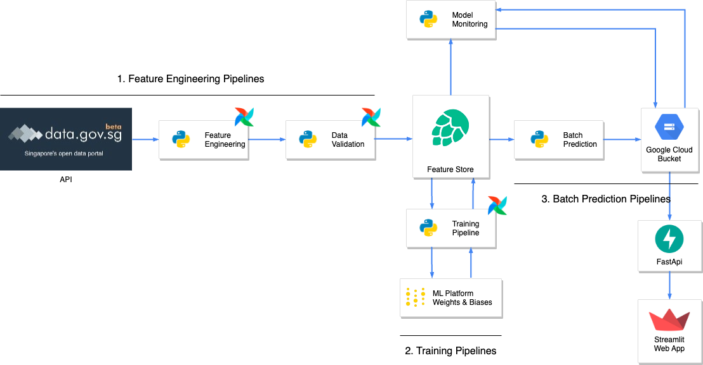
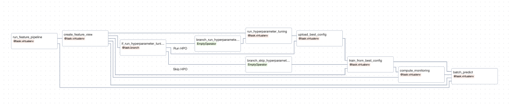
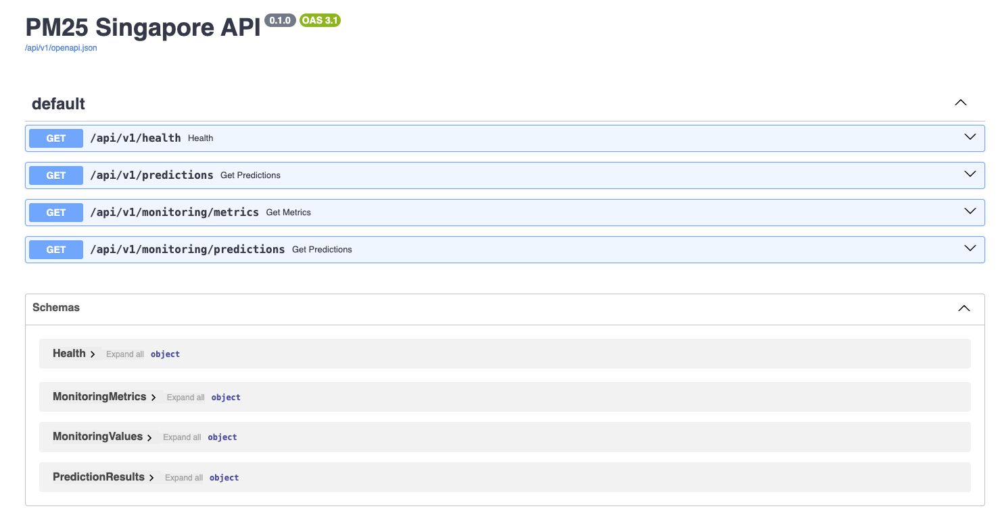
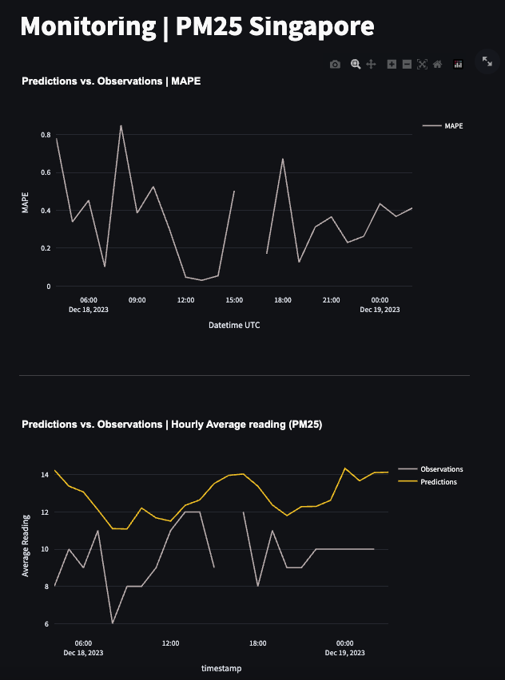
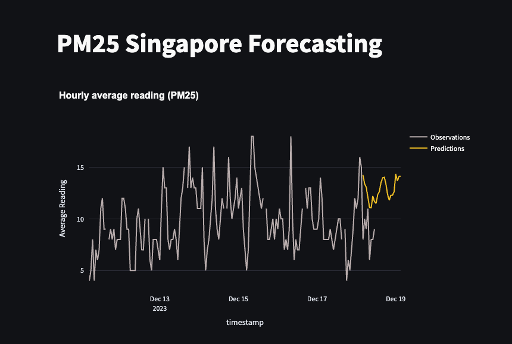

# ml_pm25

This repository serves to illustrate and end-to-end deployment of a Machine Learning platform for batch prediction pipeline using Singapore PM2.5 open API data. I have written a blog post as well to describe more about this project [here](https://www.layonsan.com/ml_system/)

## Architecture



## 1. [Feature Pipelines](feature_pipelines)

The feature pipelines section focuses on leveraging APIs for extracting data, performing some feature engineering before loading them into a feature store (Hopswork).

**Usage**
```
# to run feature pipeline separately
python3 feature_pipelines/pipeline.py
```

**Summary**
1. Extract | Data is batch extracted using a real time API from [Data Gov](https://beta.data.gov.sg/collections/1394/datasets/d_9b2d180c92c4a3c45b5c671937bd1b5d/view).
2. Transform | The following transformations were applied to the data. More transformation maybe included as we iterate through the training process.
   - renaming columns
   - casting of column types
3. Validation | Build the data validation and integrity suite
4. Load | We will load the transformed data into Hopswork feature store.

## 2. [Training Pipelines](training_pipelines)

The training pipelines section will handle the heavylifting of model training. It will first pull the dataset from the feature store (Hopswork) and load the dataset metadata into wandb. The data will then be prepared for model training, with artifact outputs rendered and uploaded to wandb during each run.

**Usage**
```
# to run training pipelines separately
python3 training_pipelines/train.py
```

**Summary**
1. Load the data from Hopsworks.
   - [data.py](training_pipelines/data.py) will load the dataset using `load_dataset_from_feature_store()` from the Hopsworks feature store with the given version of feature view and training data.   
2. Initialize a W&B run.  
   - [data.py](training_pipelines/data.py) will then log to W&B the metadata related to this dataset.
   - The data is prepared for sktime, which requires the data to be modeled using multi-indexes. The `prepare_data()` function will set the timestamp as PeriodIndexes and split the data into train and test set.  
3. Load the best_config artifact.
4. Build the baseline model.
   - [models.py](training_pipelines/models.py) will build a naive baseline model using `build_baseline_model.py`.
5. Train and evaluate the baseline model on the test split.
   - [train.py](training_pipelines/train.py) will train and evaluate the baseline model using `train_model()` and `evaluate()`. 
6. Build the fancy model using the latest best configuration.
   - [models.py](training_pipelines/models.py) will build a fancy model using Sktome and LightGBM using `buid_model()`.
7. Train and evaluate the fancy model on the test split.
   - [train.py](training_pipelines/train.py) will train and evaluate the Sktime and lightGBM models using `train_model()` and `evaluate()`. 
8. Render the results to see how they perform visually.
   - [train.py](training_pipelines/train.py) will render the visuals
9.  Retrain the model on the whole dataset. This is critical for time series models as you must retrain them until the present moment to forecast the future.
10.  Forecast future values.
11.  Render the forecasted values.
12.  Save the best model as an Artifact in W&B and the best model in the Hopsworks' model registry

## 3. [Batch Prediction Pipeline](batch_prediction_pipelines)

1. Load features from feature store in batch mode using [load_batch_data.py](batch_prediction_pipelines/load_batch_data.py)
   - `load_data_from_feature_store()` loads a batch of data between a datetime range from Hospwork feature store for training using the `get_batch_data()` method.
   - Prepare the indexes of the DataFrame for **sktime** and split between y and X (optional).
2. Load the trained model from the model registry
   - Reference from model registry using project name and model version to retrieve the best model
   - Download the artifact/model and load to memory
3. Perform forecasting for the next 24 hours
   - Predict the values using forecasting horizon (default to 24 hours) 
4. Save the predictions in a GCP bucket

## 4. [Private PyPi server with Airflow Orchestration](airflow)




## 5. Data Validation

Great Expectation (GE) suite is used for data validation. Hopswork will run the GE validation suite whenever a new dataset is inserted into the feature group.

## 6. Monitoring

### FastAPI
FastAPI is used as the backend to consume predicions and monitoring metrics from GCS and expose them through a RESTful API. A variety of endpoints are defined to GET the predictions and monitoring metrics. 

Endpoints:
- `\health`: Health check
- `\predictions`: GET prediction values
- `\monitoring/metrics`: GET aggregated monitoring metrics

Upon receiving the data request, it will access the data storage encoded to the preconfigured Pydantic schema. The retrieved response is subsequently decoded to JSON.



Head to [api README](app-api/README.md) for more details on the API

### Streamlit

Streamlit is the frontend visualisation tool to render predictions and monitoring metrics. This will be carried out in two separate applications.
- app-monitoring: render monitoring metrics

- app-predictions: render predictions


For more information, head to [app-predictions README](app-predictions/README.md) or [app-monitoring README](app-monitoring/README.md).


 