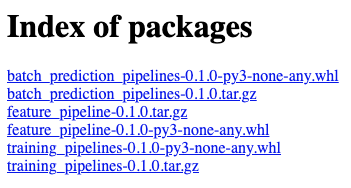
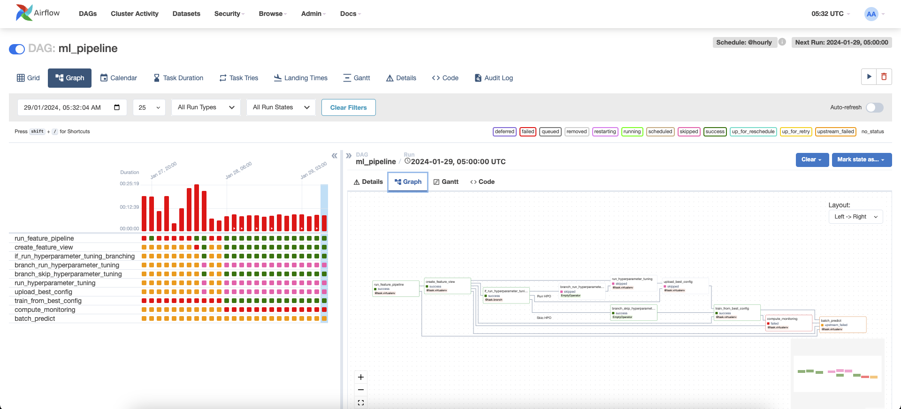

# Training Pipeline


## Poetry (my-pypi)
For each of the following directory, we will package them using poetry and publish them to the private pypi server.

- feature_pipelines
- training_pipelines
- batch_prediction_pipelines  



```
poetry build
poetry publish -r my-pypi
```


## Airflow

Run Airflow
```
 Go to the ./airflow directory.
cd ./airflow

# Initialize the Airflow database
docker compose up airflow-init
```


## Start docker services
```
# Start up all services
# Note: You should set up the private PyPi server credentials before running this command.
docker compose --env-file .env up --build -d
```

```
[+] Running 8/8
 ⠿ Container airflow-postgres-1           Started                                                         
 ⠿ Container airflow-my-private-pypi-1    Started
 ⠿ Container airflow-redis-1              Started                                                          
 ⠿ Container airflow-airflow-init-1       Started                                                          
 ⠿ Container airflow-airflow-worker-1     Started                                                          
 ⠿ Container airflow-airflow-scheduler-1  Started                                                          
 ⠿ Container airflow-airflow-triggerer-1  Started                                                          
 ⠿ Container airflow-airflow-webserver-1  Started  
```

Once containers initiated successfully, head to 
- [127.0.0.1:8080](http://127.0.0.1:8080/login/) to access the airflow UI  
- [localhost](http://localhost/) to view the private my-pypi server



